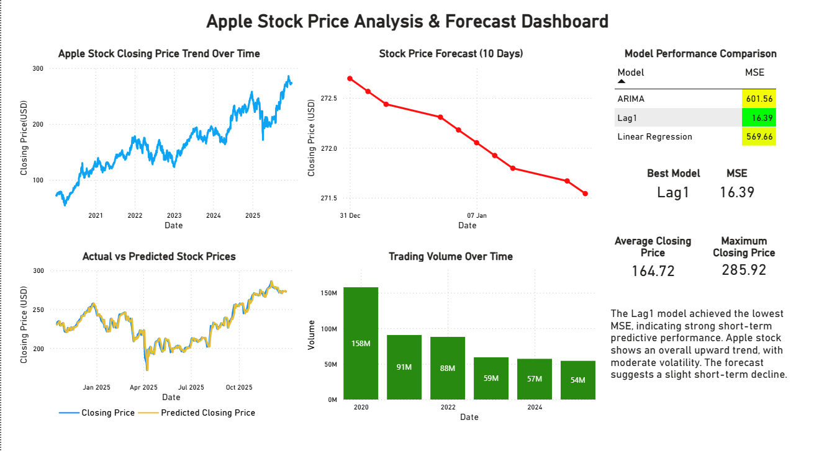

# Apple Stock Price Analysis & Forecasting

## Overview
This project analyzes historical Apple stock price data to identify trends and build predictive models. The objective is to compare different time series approaches and forecast future stock prices.

A Power BI dashboard was developed to visualize trends, model performance, and forecasts.

---

## Objectives
- Analyze stock price trends over time  
- Build forecasting models  
- Compare model performance using Mean Squared Error (MSE)  
- Identify the best-performing model  
- Visualize insights using a dashboard  

---

## Dataset
The dataset includes:
- Date  
- Closing Price  
- Open, High, Low  
- Trading Volume  

---

## Dashboard Preview

---

## Models Used

### 1. Linear Regression
A basic regression model was used as a baseline to predict stock prices without time-based dependencies.

---

### 2. Lag-Based Linear Regression
Lag features were created to capture temporal dependencies in stock prices:

- Lag1  
- Lag1 + Lag2  
- Lag1 + Lag2 + Lag3  

This approach allows the model to use previous day(s) prices to predict future values.

---

### 3. ARIMA (AutoRegressive Integrated Moving Average)
Time series models were built after making the data stationary:

- ARIMA(0,1,0)  
- ARIMA(1,1,0)  
- ARIMA(0,1,1)  
- ARIMA(1,1,1)  

ARIMA models capture autoregressive and moving average patterns in the data.

## Model Performance

| Model | MSE |
|------|------|
| Linear Regression | 569.66 |
| ARIMA | 601.56 |
| Lag1 | **16.39** |

---

## Best Model
**Lag1 Model** achieved the lowest MSE (~16.39), indicating strong short-term predictive performance.

---

## Forecasting
The Lag1 model was used to forecast stock prices for the next 10 days.  
The forecast suggests short-term movement based on recent trends.

---

## Key Insights
- Stock prices show a strong upward trend over time  
- Lag-based models outperform ARIMA for short-term prediction  
- Previous day price is highly predictive of the next day  
- Predictions closely follow actual values  
- Forecast indicates short-term price movement  

---

## Tools & Technologies
- Python (Pandas, NumPy)  
- Statsmodels (ARIMA)  
- Scikit-learn (Linear Regression)  
- Power BI  

---

## Project Structure
apple-stock-analysis/
│
├── data/
├── notebooks/
├── images/
│ └── apple_dashboard.png
├── models/
├── app/
├── README.md

---

## How to Run
1. Clone the repository  
2. Open the notebook in Jupyter  
3. Run all cells to reproduce results  

---

## Dashboard
Power BI dashboard included in the repository.

---

## Author
Gayathri Karagoda Pathiranage  
Aspiring Data Analyst  
